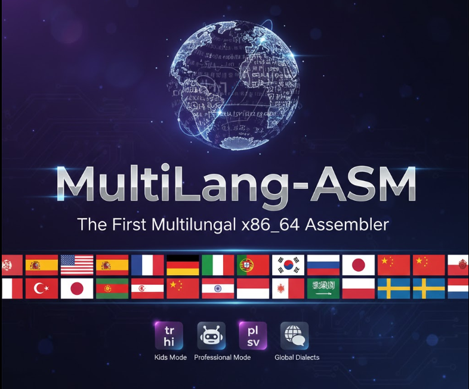

# MultiLang-ASM
<p align="center">
  
</p>
**The first multilingual x86_64 assembler.**  

Write assembly in your native language · 50+ languages & dialects · 80+ instructions · reversible translation · NASM-compatible.

[](https://opensource.org/licenses/MIT)
[](langs/)
[](BABEL_COMMUNITY.md)
[](https://www.python.org/)


📜 **[Genealogía del Ecosistema Neuro-ASM](https://github.com/cyberenigma-lgtm/NeuroUniversalASM/blob/main/docs/genealogia_neuro_asm.md)**  
Consulta la evolución completa desde MultiLang-ASM hasta NeuroWill-Code.

📖 **[English](README.md)** | **[Español](README_ES.md)** | **[Français](README_FR.md)** | **[Deutsch](README_DE.md)** | **[Italiano](README_IT.md)** | **[Português](README_PT.md)** | **[Русский](README_RU.md)** | **[日本語](README_JA.md)** | **[中文](README_ZH.md)** | **[한국어](README_KO.md)** | **[العربية](README_AR.md)** | **[Bahasa](README_ID.md)** | **[Hindi](README_HI.md)** | **[Türkçe](README_TR.md)** | **[Polski](README_PL.md)** | **[Svenska](README_SV.md)** | **[Nederlands](README_NL.md)**

---

## 🚀 What is MultiLang-ASM?

MultiLang-ASM is the world's first multilingual assembler layer for x86_64.  
It allows developers to write assembly code using natural language keywords in their own language, and automatically translates it into standard NASM-compatible assembly.

It also supports **reverse translation**, allowing developers to view standard ASM in any supported language.

**Example:**
```asm
; Spanish
mover rax, 1
llamada_sistema

; Translates to →
mov rax, 1
syscall
```

---

## ✨ Features

- 🧩 **Modular Language Packs** (New in v0.6!)
- 🛠️ **CLI for Contributors**: `--list-langs`, `--new-lang`
- 🧠 **Write assembly in your native language**
- 🤖 **Auto-Detection** of source language
- ⚡ **Macros** (%define) support
- 🔁 **Reversible translation** (ASM → Language → ASM)
- 🧪 **Examples and tests included**
- 🔌 **Easy integration with Make, CMake, CI/CD**

## 🔥 What's New in v0.7 (Global Expansion)

### 🌍 World-Wide Accessibility
**Version 0.7 reached technical parity across 50+ languages and dialects!**

- 🏛️ **Total 56 Variants**: Added support for regional languages across Europa, América, África, Asia and Oceanía.
- 🗣️ **New Highlights**: Quechua, Náhuatl, Zulú, Afrikaans, Bengalí, Tamil, Telugu, Javanés, Maorí, and more.
- ⚙️ **Instruction Parity**: All languages now support 80+ instructions (Movement, Arithmetic, Control, Bits, Strings, Stack, System).
- 📚 **Full Documentation**: Individual `INSTRUCCIONES_<LANG>.md` for **all 50+ languages**!
- 🗺️ **Country Coverage**: New [Listado de Países y Lenguas](LISTA_PAISES_LENGUAS.md) for global reference.

## 🔥 What's New in v0.6 (Released)

### 🌍 Babel Community Edition
**The modular era has arrived!** Language definitions are no longer hardcoded into the core engine. 

- 📂 **Dynamic Loading**: Just drop a `.py` file into `langs/` and it works! 
- 🛠️ **Contributor CLI**: 
  - `python mlasm.py --list-langs` (See all installed languages)
  - `python mlasm.py --new-lang <iso>` (Bootstrap a new language pack)
- 🛡️ **Governance**: New [Code of Conduct](CODE_OF_CONDUCT.md) and [Security Policy](SECURITY.md).

### 🚀 Join the [Babel Community](BABEL_COMMUNITY.md)!

## 🔥 What's New in v0.5

### 🧸 Kids Mode (Modo Niños)
**New!** We have moved the educational suite to its own dedicated home.
👉 **[Visit MultiLang-ASM Kids Repository](https://github.com/cyberenigma-lgtm/MultiLang-ASM-Kids)**

- 📚 **[Kids Wiki & Guide](https://github.com/cyberenigma-lgtm/MultiLang-ASM-Kids/wiki)**
- 🎮 **[Exercises & Examples](https://github.com/cyberenigma-lgtm/MultiLang-ASM-Kids/tree/main/examples)**
- 🏫 **Teacher Resources**

Simplified syntax for 27 languages:
```asm
; Kids Mode (Spanish)
pon rax a 5
suma rax con 3
enseña rax
```

### 🛡️ Professional Mode
Standard ASM syntax (`MOV`, `ADD`, `SUB`) with multilingual comments and error handling. Compatible with standard NASM pipelines.

---

## 🏗️ The Philosophy: "A Bridge, Not a Bubble"
To our friends in the **OSDev Community**: We are not reinventing the wheel. We are building a ramp to it.

MultiLang-ASM acts as a zero-overhead **Bridge Tool**.
1.  **Stage 1:** Accessibility (Kids/Native Syntax)
2.  **Stage 2:** Transition (Bilingual Code)
3.  **Stage 3:** Standard Proficiency (Pure NASM)

👉 **[Read the Transition Guide](docs/TRANSITION_GUIDE.md)** to see how we guide users from `pon` to `mov` without magic.
**Output is 100% NASM Compatible.** No runtime. No abstraction layer. Just access.

---

## 🌍 Supported Languages

MultiLang-ASM v0.7 supports **56 variants**. For a complete list and links to technical manuals, see **[Supported Languages Table](wiki/Supported-Languages.md)**.

---

## 📁 Project Structure

```
MultiLang-ASM/
├── mlasm.py              # Core translation engine
├── langs/                # Language Packs (Modular)
├── wiki/                 # Local Wiki (Troubleshooting, How it works)
│   ├── Supported-Languages.md
│   ├── TROUBLESHOOTING.md
│   └── HOW_IT_WORKS.md
├── examples/             # Examples (Bilingual & Advanced)
├── docs/                 # Instruction Manuals (INSTRUCCIONES_<LANG>.md)
├── LISTA_PAISES_LENGUAS.md # List of Countries and Languages
├── BABEL_COMMUNITY.md    # Community & Governance
└── README.md             # This file
```

---

## 📜 License

MIT License - See [LICENSE](LICENSE) for details.

---

## 📧 Contact

**Email:** neuro.so.ia.sim@gmail.com  
🛡️ **Part of the [Neuro-OS](https://neuro-os.es) ecosystem**
