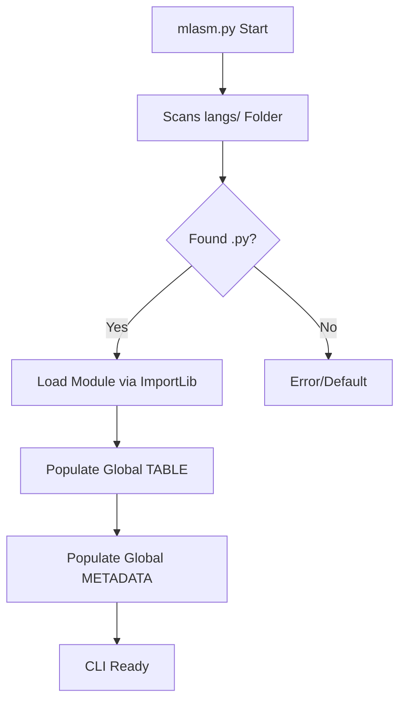

# 🏗️ Arquitectura Modular (Babel v0.6)

MultiLang-ASM v0.6 marca la transición de un motor monolítico a un sistema de **micro-paquetes de idiomas**.

## ¿Cómo funciona el motor?

El archivo `mlasm.py` actúa como un orquestador. Al iniciarse, ejecuta la función `load_language_packs()`:

1. **Escaneo**: Busca todos los archivos `.py` dentro de la carpeta `langs/`.
2. **Carga Dinámica**: Utiliza `importlib.util` para importar cada archivo como un módulo independiente.
3. **Inyección de Diccionarios**: 
   - Extrae `KEYWORDS` y los fusiona en la tabla global.
   - Extrae `KIDS_KEYWORDS` para el soporte educativo.
   - Extrae `METADATA` para el sistema de información del CLI.

## Diagrama de Flujo

## Ventajas del sistema v0.6
- **Ligereza**: El motor central no pesa casi nada.
- **Portabilidad**: Puedes compartir solo tu archivo `.py` de idioma.
- **Seguridad**: Los errores en un paquete de idioma no rompen necesariamente la ejecución de los otros.
